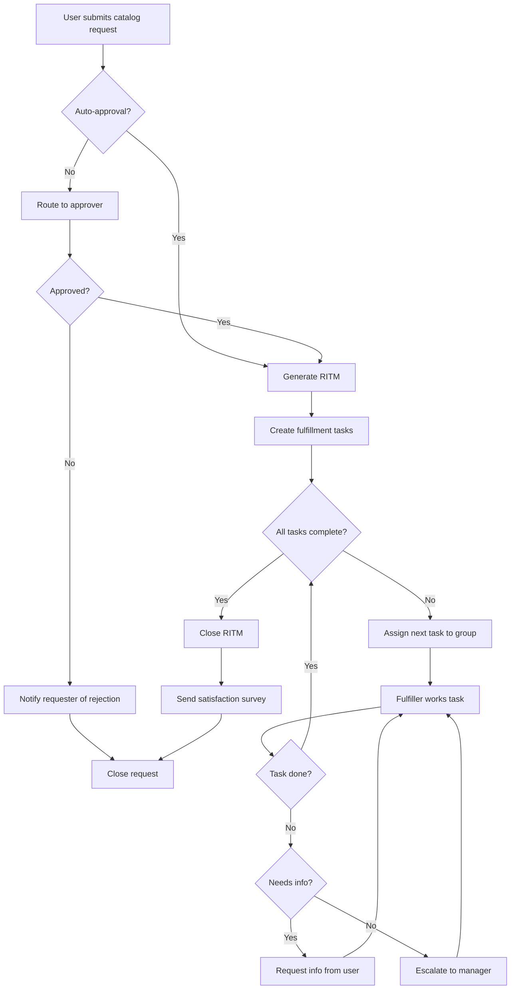

# Top Level Heading

Intro paragraph under the h1. This section should collapse when you click the heading.

## Section One

Content under section one. Has a nested heading below.

### Subsection 1.1

This is nested under Section One. Should be its own inner accordion.

Some **bold** and _italic_ text, plus a `code snippet`.

### Subsection 1.2

Another nested section. Click to collapse just this part.

- Item A
- Item B
- Item C

## Section Two

Content under section two.

> A blockquote lives here.

### Subsection 2.1

Deeper nesting still works.

| Column A | Column B |
|----------|----------|
| Cell 1   | Cell 2   |
| Cell 3   | Cell 4   |

## Section Three

A code block:

```js
function hello() {
  console.log("headings should not match inside code blocks");
}
```

# Second Top Level Heading

This is a second h1. Everything above should be independent of this section.

## Nested Under Second H1

Content here.

## Mermaid Diagram

A service catalog request flow:


